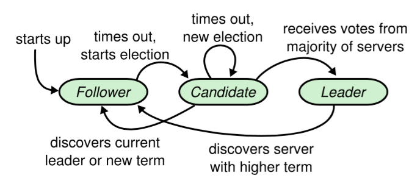

# 共识算法之：Raft

## 简介

Paxos算法是分布式系统领域最重要的一致性算法，同时也是公认的最为艰深难懂的算法。为了解决这个晦涩难懂的问题，斯坦福大学的Diego Ongaro、John Ousterhout教授以容易理解（Understandability）为目标设计了这个新的一致性算法：Raft，并在2013年发布了论文：《In Search of an Understandable Consensus Algorithm》。为了验证这个容易理解的特性，他们分别在斯坦福大学和加州大学伯克利分校的分布式计算课程上，使用了Raft和Paxos两种算法，采用视频教学的方式来传授给学生，之后采用小测验的方式来验证。结果表明Raft比Paxos容易理解很多。

Raft和Paxos一样只要保证n/2+1节点（即超过半数节点）正常工作就能够提供服务。在设计层面，Raft把算法流程分为三个子问题：领导选举（Leader election）、日志复制（Log replication）、安全性（Safety）。 Raft开始时在集群中选举出Leader负责日志复制的管理，Leader接受来自客户端的事务请求（日志），并将它们复制给集群的其他节点，然后负责通知集群中其他节点提交日志，Leader负责保证其他节点与他的日志同步，当Leader宕机后集群其他节点会发起选举选出新的Leader。

## Raft算法详解

### 角色

Raft把集群中的节点分为三种状态：Leader、Follower和Candidate，在任一时间，每一个节点都只能处于这三种状态中的一种，相应的我们把每一种状态称为一种角色，每种角色的任务也是不一样的：

* Leader（领导者）：负责日志的同步管理，处理来自客户端的请求，与Follower保持着heartBeat的联系
* Follower（追随者）：刚启动时所有节点都处于Follower状态，响应Leader的日志同步请求，响应Candidate的请求，把Client请求到Follower的事务转发给Leader
* Candidate（候选者）：发起选举投票，Raft刚启动时由一个节点从Follower转为Candidate发起选举，选举出Leader后从Candidate转为Leader状态

Raft节点的状态转换图

Raft刚启动的时候，所有节点初始状态都是Follower，每一个节点都设置了一个随机的超时时间，这个时间一般是在150毫秒到300毫秒之间。超时时间内如果没有收到Leader的请求则转换为Candidate角色并发起Leader选举。如果Candidate收到了多数节点的选票则转换为Leader；如果在发起选举期间发现已经有Leader了，或者收到更高任期的请求则转换为Follower。Leader在收到更高任期的请求后转换为Follower。

### 任期（Term）

Raft把时间切割为任意长度的任期（Term），每个Term都是一个连续递增的编号，采用连续的整数来表示。每个任期都由一次选举开始，每一轮选举都是一个Term任期，若选举失败则这个任期内没有Leader。如果选举出了Leader则这个任期内由Leader负责集群状态管理，在一个Term中只能产生一个Leader。

Raft中Term图示

先描述下Term的变化流程：Raft开始时所有Follower的Term为1，其中一个Follower的超时时间到期后转换为Candidate，Term加1（这时Term变为2），然后开始选举，这时候有几种情况会使Term发生改变：

* 如果当前Term为2的任期内没有选举出Leader或出现异常，则Term递增，开始新一任期选举
* 当这轮Term为2的周期选举出Leader后，过一段时间之后Leader挂掉了，然后其他Follower转为Candidate，Term递增，开始新一任期Leader选举
* 当Leader或Candidate发现自己的Term比别的Follower小，Leader或Candidate将转为Follower，Term递增
* 当Follower的Term比别的Term小，Follower也将更新Term保持与其他Follower一致

每次Term的递增都将发生新一轮的选举，Raft保证一个Term任期内只有一个Leader，在Raft正常运转中所有的节点的Term都是一致的，如果节点不发生故障一个Term会一直保持下去，当某节点收到的请求中Term比当前Term小时则拒绝该请求。
　　

### 领导选举（Leader Election）

有两种情况会触发选举：

* Raft初次启动时，不存在Leader，这时候会触发Leader选举
* Follower在自己的超时时间内没有接收到Leader的heartBeat，触发election timeout，从而Follower的角色切换成Candidate，Candidate会发起选举

当一个节点的状态由Follower转换为Candidate后，立刻就触发了Leader选举，Candidate节点首先会把Term号加1，然后向所有其他节点发起Leader Request Vote请求，这时候有以下几种可能的情况发生：

* 该Request Vote请求接收到n/2+1个节点（过半数）的投票，从Candidate转为Leader，然后立刻向其他节点发送heartBeat以保持Leader的正常运转。必须要收到过半数的投票，保证了在一个Term周期内，只有一个Leader存在
* 在此期间如果收到其他节点发送过来的Append Entries请求，如该节点的Term号大于自己的Term号，则当前节点转为Follower，否则拒绝该请求，保持自己为Candidate
* 收到其他节点的Request Vote请求，如果请求中的Term号大于Candidate当前的Term号，则认为自身的Term已经过期了，自身转换为Follower，并且给其他节点投票。如果其他节点的Term号小于自身的Term号，则拒绝该请求并保持自身的Candidate角色
* 在此期间如果没有收到足够多的投票，然后会发生超时，则Term递增，发起新一轮选举

当一个Candidate转换成为Leader之后，需要周期性的发送心跳包（如果有正常的RPC请求情况下则可以不发心跳）保持自己Leader的角色（避免集群中其他节点认为没有Leader而开始选举）。

Follower在收到Leader或者Candidate的RPC请求的情况下一直保持Follower状态。而当一段时间内（election timeout）没有收到请求则认为没有Leader节点而再次触发选举流程。　

### 分裂选举

在一个Term期间每个节点只能投票一次，所以当有多个Candidate存在时就会出现每个Candidate发起的选举都存在接收到的投票数都不过半的问题，这时每个Candidate都将Term递增、重启定时器并重新发起选举，由于每个节点中定时器的时间都是随机的，所以就不会多次存在有多个Candidate同时发起投票的问题。

每一个Follower的超时时间设置，都是采用随机时间的方式，时间周期在150毫秒到300毫秒之间。如果所有Follower的超时时间设置都一样，那么Follower都会在几乎同一时间切换成Candidate，这些Candidate又会同时都发起Leader选举，这种情况下，几乎不会有Candidate能够收到超过一半的节点给予的投票，从而进入下一轮的选举。随机超时时间虽然不能绝对确保时间都不相同，但是产生出相同的随机时间毕竟是非常小概率的事件，而且这种情况也会很快就被下一轮随机时间所解决。

两个或者多个Follower同时转换为Candidate并且发起选举的时候，如果其中有一个Candidate能够收到半数以上的投票，那么自然就会成为Leader并且发送heartBeat信息，开始新一轮Term周期。如果没有任何一个Candidate获得超过半数以上的投票，那么在这一段时间内，每一个节点又开始了新一轮超时时间周期，在这一轮超时时间周期内，由于没有Leader，所有的节点都不可能收到heartBeat消息。随后，第一个到达超时时间的节点会发起新一轮的Leader选举，从而打破这种平衡。

### 日志复制（Log Replication）

一旦Leader被选举出来后，Leader就开始为集群服务：处理所有的客户端请求并将数据复制到所有节点。

一旦日志被“安全”的复制，那么Leader将这个日志应用到自己的状态机并响应客户端。

如果有节点异常或网络异常，Leader会一直重试直到所有日志都会正确复制到所有节点（日志不允许有空洞，所以每个节点上的日志都是连续的，不能有因为失败引起的空洞）。

日志组织形式如上图，每个日志条目中包含可执行的指令、和日志被创建时的任期号，日志条目也包含了自己在日志中的位置，即index。一旦一个日志条目存在于大多数节点，那么该日志条目是committed的。

Raft算法保证所有committed的日志都是持久化的。日志需要在大多数节点上持久化之后再响应给客户端，这意味着每个Follower节点收到Append Entry请求后需要持久化到日志之后再响应给Leader，且最终会被所有的状态机执行。

Raft算法保证了以下特性：

* 如果两个日志条目有相同的index和term，那么他们存储了相同的指令（即index和term相同，那么肯定是同一条指令，就是同一个日志条目）
* 如果不同的日志中有两个日志条目，他们的index和term相同，那么这个条目之前的所有日志都相同

两条规则合并起来的含义：两个日志LogA、LogB，如果LogA[i].index=LogB[i].index且LogA[i].term=LogB[i].term，那么LogA[i]=LogB[i]，且对于任何k < i的日志条目，LogA[k]=LogB[k]都成立。

### 安全性（Safety）

安全性是用于保证每个节点都执行相同序列的安全机制，如当某个Follower在当前Leader commit Log时变得不可用了，稍后可能该Follower又会被选举为Leader，这时新Leader可能会用新的Log覆盖先前已committed的Log，这就是导致节点执行不同序列；Safety就是用于保证选举出来的Leader一定包含先前committed Log的机制。

* 选举安全性（Election Safety）
* 每个Term只能选举出一个Leader
* Leader完整性（Leader Completeness）

这里所说的完整性是指Leader日志的完整性，当Log在Term1被Commit后，那么以后Term2、Term3、Term4…等的Leader必须包含该Log。Raft在选举阶段就使用Term的判断用于保证完整性：当请求投票的该Candidate的Term较大或Term相同Index更大则投票，否则拒绝该请求。
　　
　　
## 小结

Raft以容易理解为设计目标，通过前面的描述可以感受到，相比于Paxos，Raft的确非常容易理解。在工程上，也已经有了众多的项目在实际上使用Raft作为其一致性算法，比如著名的高可用分布式的键值数据存储系统etcd（https://github.com/coreos/etcd）

