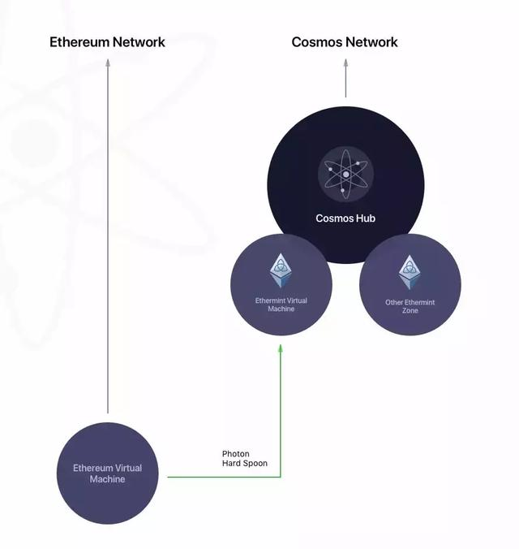

# cosmos费用代码photon
## 一、介绍
在Cosmos中，使用的代币是Atom，这个基本上都没有什么不了解。但是，在新的经济模型中，Cosmos又引入了一种费用代币，在前面提到过的，名字叫做Photon。基本上大家都明白的是，原生代币可以用来创建一整套围绕着区块链本身的经济模型的基础。比如以太坊，通过以太币，衍生出gas控制，挖矿机制等。同理，很容易理解Atom代币本身，但是Photon这个费用代币又是什么？他来干什么？
 
Photon是一种次级的费用代币，同样也是在Cosmos原生的。它的核心作用是用于交易。当然，它比Atom拥有更高的流动性。Photon，原意是不连续能量包的基本粒子，它可以携带调整的可见光。所以，干脆就叫光子（Photon）。
 
Photon不会和其它代币一样进行公开发售，那么怎么样才能得到这个代币呢？网上的资料（https://medium.com/m/global-identity?redirectUrl=https%3A%2F%2Fblog.cosmos.network%2Fintroducing-the-hard-spoon-4a9288d3f0df）所言是通过一次以太坊的状态的hard spoon来分发这种代币。
 

## 二、多代币和单一代币的比较
## 1、单一代币
在目前主流的区块链上，大多提单一代币的模式，比如比特币和以太坊。以以太坊为例，以太坊的代币既可以进行抵押也可以交易。但是，正如一个优点从某一个角度来看恰恰是一种缺点一样，单一代币简单明了，但是人们在其上面寄托了所有的功能的梦想。而在攻击者看来，这正好是一个弱点，他们只要从某一个角度切入进去，就可以顺理成章的把所有的坏事做到。当然，从理论上讲，这种风险不是没有被考虑过，但应该是觉得属于可控的范围。可是，风险终究是被放大了，至于放大到什么程度，放大到了人们是否可以忍受的地步，这个得经过时间的考验。
 

## 2、多代币
和单一代币正好相反，划分出专门来人事某一类功能的代币，会隔离开不同代币所代表的功能区间。正如Atom和Photon两种代币，前者单纯用来抵押，后者单纯用来交易。Cosmos通过生态系统将二者有机的结合起来。这样，对Cosmos网络的攻击从理论上会被缩小，由于Atom的流动性变差，其价格升高，导致任何人想垄断Atom付出的代价是得不尝失的。
 
同样，在跨链中，不同的链对手续费的计价方式不同，这就导致了类似现实世界的汇率问题。而如果使用单纯的交易代币则可以减少这种汇率的风险。当然，这有一个前提，必须是使用Cosmos的网络。
 
大家如果对此事情兴趣，可以阅读相关的文档：
 
https://drive.google.com/file/d/1jtyYtx7t1xy9gxEi2T5lXFNd8xUY7bhJ/view
 
## 3、Photon的分发使用
Cosmos的生态中，可以使用其进行费用的转移交付。换句话说，任何在Cosmos生态中的产生的费用，都可以用其支付。Photon和其它区块链代币的产生类似，它以500/个以固定的比例生产出来。不过，这也是一种权衡的措施，因为它无法抵御通货膨胀。
 
代币的分发，是通过复制整个以太坊的状态，这其中包括智能合约的状态，然后运行兼容的Ethermint的环境，将复制的状态（包括EVM）运行在Tendermint的共识上，这样在Cosmos网络启动时，以太坊的持有者，就可以要求获得Photon并将其转移到Cosmos的相关帐户上。需要说明的是，这个Photon获得的状态空间（Ethermint空间），只是一个获得代币的手段，它没有其它用处。
 

 

## 三、总结
前面只是简单介绍了Photon这种代币和Cosmos的多代币的生态模式，但是Cosmos的演进速度太慢了，所以无法现在就说明哪种更好，哪种不好。这都需要进一步的看链的主体的开发的过程。但是，Cosmos的这种多代币的生态确实是给人们提供了一条新的思路。
 
不断的创新才是区块链能够发展的前提，不管这种创新最终能否促进区块链的技术的提高。
 
