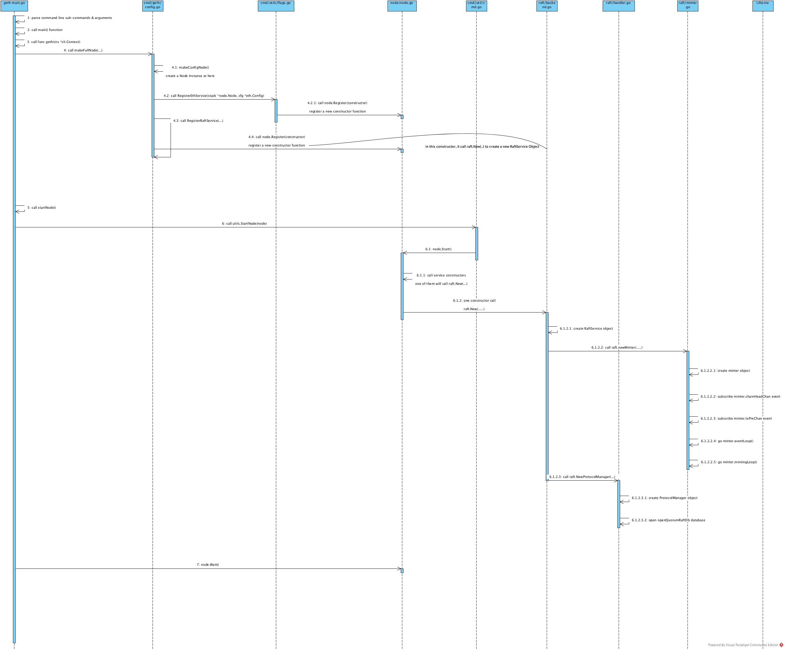

# J.P.Morgan Quorum 共识算法

## 简介

J.P.Morgan的Quorum是在Ethereum的基础上修改的，他们的理念之一就是，不要重复造轮子，小编很是认可这个理念。他们把Ethereum的PoW共识算法修改成了Raft算法，并且使用了etcd的Raft实现。由于Quorum是用于企业级分布式账本和智能合约平台，提供私有智能合约执行方案，是联盟链方案，而不是公链。所以项目方认为，在这种场景下，拜占庭容错是不需要的，分叉也是不会存在的。取而代之的是，需要更快的出块时间和交易确认。这种共识算法还不会产生出“空快”，并且在需要的时候可以快速有效的创建出新块。

在geth命令添加 --raft 选项，就会使得geth节点运行raft共识算法。

## 几个基本概念

Raft和Ethereum都有自己的“节点”概念，但它们稍微有点儿不一样。

在Raft里面，一个“节点”在正常操作的时候，要么是Leader，要么是Follower。在整个集群里面，只有一个Leader，所有其他的节点都要从这个Leader来获取日志数据。这里还有一个Candidate的概念，不过仅仅是在Leader选举期间才有。

但是在Ethereum里面却没有Leader和Follower这样的概念，对于任何一个节点来说，都可以创建一个新块(只要计算足够快)，这就类似于Raft里面的Leader。

在基于Raft的共识算法中，在Raft和Ethereum节点之间做了一对一的对应关系，每个Ethereum节点也是Raft节点，并且按照约定，Raft集群的Leader是产生新块的唯一Ethereum节点。这个Leader负责将交易打包成一个区块，但不提供工作量证明(PoW)。

| Ethereum | Raft |
| :-: | :-: |
| minter(旷工) | leader(领导者) |
| verifier(验证者) | follower(追随者) |

在这里把Leader和产生新块的节点绑定到一起的主要原因有两点：第一是为了方便，因为Raft确保一次只有一个Leader，第二是为了避免从节点创建新块到Leader的网络跳转，所有的Raft写入操作都必须通过该跳转。Quorum的实现关注Raft Leader的变化——如果一个节点成为Leader，它将开始产生新块，如果一个节点失去Leader地位，它将停止产生新块。

在Raft的Leader转换期间，其中有一小段时间，有多个节点可能假定自己具有产生新块的职责；本文稍后将更详细地描述如何保持正确性。

Quorum使用现有的Etherum P2P传输层来负责在节点之间的通讯，但是只通过Raft的传输层来传输Block。这些Block是由Leader创造的，并从那里传输到集群的其余部分，总是以相同的顺序通过Raft传输。

当Leader创建新块时，不像在Ethereum中，块被写入数据库并立即成为链的新Head，只在新块通过Raft传输之后才插入块或将其设置为链的新Head。所有节点都会在锁定步骤中将链扩展到新的状态，就好像是他们在Raft中同步日志。

从Ethereum的角度来说，Raft是通过实现 node/service.go 文件中的 Service 接口而集成的。一个独立的协议可以通过这个 Service 接口，注册到节点里面。

```go
// quorum/cmd/geth/config.go
func makeFullNode(ctx *cli.Context) *node.Node {
  if ctx.GlobalBool(utils.RaftModeFlag.Name) {
    // 在这里判断，如果是raft mode，则注册raft service
    RegisterRaftService(stack, ctx, cfg, ethChan)
  }
}

func RegisterRaftService(stack *node.Node, ctx *cli.Context, cfg gethConfig, ethChan <-chan *eth.Ethereum) {
  // 在这里把raft service注册到node里面去
  if err := stack.Register(func(ctx *node.ServiceContext) (node.Service, error) {
    // 调用raft.New创建raft service，这个RaftService实现了node.Service接口
    return raft.New(ctx, ethereum.ChainConfig(), myId, raftPort, joinExisting, blockTimeNanos, ethereum, peers, datadir)
	}); err != nil {
}
```




## 一笔交易的生命周期

现在，让我们来看看一个典型的交易的生命周期

##### 在任意一个节点上(挖矿者或者验证者)
1. 通过RPC接口向geth提交一笔交易
2. 利用Ethereum现有的交易传播机制，把交易广播给所有的节点。同时，因为当前集群都被配置成为“静态节点”模式，所以每一个交易都会被发送给集群中的所有节点

##### 在挖矿者节点
3. 挖矿节点接收到交易之后，通过把这个交易加入交易池(transaction pool)的方式加入到下一个block中
4. 创建新块的工作将会触发一个NewMinedBlockEvent事件，Raft协议管理者通过订阅了minedBlockSub来接收这个事件。在raft/handler.go文件中的minedBroadcastLoop方法会把这个新块发送到ProtocolManager.proposeC channel.

下面是 NewMinedBlockEvent 事件的定义
```go
// quorum/core/events.go
type NewMinedBlockEvent struct{ Block *types.Block }
```

下面的三个代码块展示了，订阅事件，创建新块的时候触发事件，以及在接收端转发这个事件。

```go
// quorum/raft/handler.go
func (pm *ProtocolManager) Start(p2pServer *p2p.Server) {
	pm.p2pServer = p2pServer
	pm.minedBlockSub = pm.eventMux.Subscribe(core.NewMinedBlockEvent{})
	pm.startRaft()
	go pm.minedBroadcastLoop()
}

// quorum/miner/worker.go
func (self *worker) wait() {
  for {
    mustCommitNewWork := true
    for result := range self.recv {
        // Broadcast the block and announce chain insertion event
        self.mux.Post(core.NewMinedBlockEvent{Block: block})
    }
  }
}

// quorum/raft/handler.go
func (pm *ProtocolManager) minedBroadcastLoop() {
	for obj := range pm.minedBlockSub.Chan() {
		switch ev := obj.Data.(type) {
		case core.NewMinedBlockEvent:
			select {
			case pm.blockProposalC <- ev.Block:
			case <-pm.quitSync:
				return
			}
		}
	}
}

```

5. serveLocalProposals在这个channel的出口处等待接收这个新块，它的任务是使用RLP的方式对这个block进行编码并且提交给Raft协议。一旦这个新块通过Raft的同步协议同步到了所有的节点，这个新块就成为整个链的最新Head。下面的代码块展示了这个过程。

```go
// quorum/raft/handler.go
func (pm *ProtocolManager) serveLocalProposals() {
	for {
		select {
		case block, ok := <-pm.blockProposalC:
			size, r, err := rlp.EncodeToReader(block)
			var buffer = make([]byte, uint32(size))
			r.Read(buffer)
			// blocks until accepted by the raft state machine
			pm.rawNode().Propose(context.TODO(), buffer)
		}
	}
}
```

##### 在任意一个节点上

6. 到了这个时间点，Raft协议会达成共识并且把包含新块的日志记录添加到Raft日志之中。Raft完成这一步是通过Leader发送AppendEntries给所有的Follower，并且所有的Follower对这个消息进行确认。一旦Leader收到了超过半数的确认消息，它就通知每一个节点，这个新的日志已经被永久性的写入日志。
7. 这个新块通过Raft传输到整个网络之后，到达了eventLoop，在这里处理Raft的新日志项。他们从Leader通过pm.transport(rafthttp.Transport的一个instance)到达。

```go
// quorum/raft/handler.go
func (pm *ProtocolManager) eventLoop() {
	for {
		select {
		case <-ticker.C:
		// when the node is first ready it gives us entries to commit and messages
		// to immediately publish
		case rd := <-pm.rawNode().Ready():

			// 1: Write HardState, Entries, and Snapshot to persistent storage if they
			// are not empty.
			pm.raftStorage.Append(rd.Entries)

			// 2: Send all Messages to the nodes named in the To field.
			pm.transport.Send(rd.Messages)

			// 3: Apply Snapshot (if any) and CommittedEntries to the state machine.
			for _, entry := range pm.entriesToApply(rd.CommittedEntries) {
				switch entry.Type {
				case raftpb.EntryNormal:
					var block types.Block
					err := rlp.DecodeBytes(entry.Data, &block)

					if pm.blockchain.HasBlock(block.Hash(), block.NumberU64()) {
					} else {
						pm.applyNewChainHead(&block)
					}

				pm.advanceAppliedIndex(entry.Index)
			}

		case <-pm.quitSync:
			return
		}
	}
}

```

8. 下一步是applyNewChainHead会处理这个新块。这个方法首先会检查这个新块是否扩展了链(比如：其parent是当前链的head)。如果这个新块没有扩展链，他会被简单的忽略掉。如果这个新块扩展了链，并且这个新块是有效的，则会通过InsertChain把这个新块写入链中并且作为链的Head.

```go
// quorum/raft/handler.go
func (pm *ProtocolManager) applyNewChainHead(block *types.Block) {
	if !blockExtendsChain(block, pm.blockchain) {
		headBlock := pm.blockchain.CurrentBlock()

		pm.minter.invalidRaftOrderingChan <- InvalidRaftOrdering{headBlock: headBlock, invalidBlock: block}
	} else {
		if existingBlock := pm.blockchain.GetBlockByHash(block.Hash()); nil == existingBlock {
			if err := pm.blockchain.Validator().ValidateBody(block); err != nil {
				panic(fmt.Sprintf("failed to validate block %x (%v)", block.Hash(), err))
			}
		}
		_, err := pm.blockchain.InsertChain([]*types.Block{block})
	}
}


// quorum/core/blockchain.go
func (bc *BlockChain) InsertChain(chain types.Blocks) (int, error) {
	n, events, logs, err := bc.insertChain(chain)
	bc.PostChainEvents(events, logs)
	return n, err
}
```

9. 通过发送一个ChainHeadEvent事件来通知所有的listener，这个新块已经被接受了。因为下面这些原因，这个步骤是非常重要的：
 1. 从交易池(transaction pool)中删除相关的交易
 2. 从speculativeChain的proposedTxes中删除相关的交易
 3. 触发requestMinting(在minter.go文件中)事件，通知节点准备创建新块

```go
// quorum/core/blockchain.go
func (bc *BlockChain) PostChainEvents(events []interface{}, logs []*types.Log) {
	for _, event := range events {
		switch ev := event.(type) {
		case ChainEvent:
			bc.chainFeed.Send(ev)

		case ChainHeadEvent:
			bc.chainHeadFeed.Send(ev)

		case ChainSideEvent:
			bc.chainSideFeed.Send(ev)
		}
	}
}
```

现在, 该交易在群集中的所有节点上都可用, 并且最终确认了。因为Raft保证了存储在其日志中的条目的单一顺序, 而且由于所提交的所有内容都保证保持不变, 所以没有blockchain在Raft上生成的分叉。


## 链延长、竞争和纠错

Raft负责达成共识, 有哪些区块可以被链接受。在最简单的情况下, 通过Raft的每个后续块都成为新的链Head。

然而, 在一些比较极端的情况下, 可能会遇到一个新的块, 已经通过Raft传播到整个集群，但却不能作为新的链Head。在这种情况下, 利用Raft的日志顺序, 如果我们遇到一个块, 其parent目前不是链的Head, 我们只是简单地跳过这个日志条目。

最常见的情况是, 在Leader发生变化时, 最有可能触发这种情况。领导者可以被认为是一个代理，这个代理应该创建新块，这通常都是正确的, 并且只有一个单一的新块创建者。但是不能依赖于一个新块创建者的最大并发量来保持正确性。在这样的过渡过程中, 两个节点可能会在短时间内都会创建新块。在这种情况下, 将会有一场竞赛, 成功扩展链条的第一块将会获胜, 竞赛的失败者将被忽略。

请考虑下面的示例, 在这种情况下, Raft试图延长链的日志项被表示为:

[ 0xa12345 Parent: 0xea097c ]

其中0xa12345是新块的id, 0xea097c是其parent的id。这里初始的挖矿节点(节点1)被分区, 节点2作为后续挖矿节点接管挖矿工作。


新块提交过程：

链的初始状态：[ 0xa12345 Parent: 0xea097c ]


 | 步骤 | 节点1 | 节点2 |
 | :-: | :-: | :-: |
 | 1 | 发生网络分区，节点1被划分到另外一个小区 | 节点2被选择成为新的Leader(挖矿者) |
 | 2 | [ 0x90f72a Parent: 0xa12345 ] | [ 0x69c92376 Parent: 0xa12345 ] |
 | 3 |  | [ 0xb7239ae Parent: 0x69c92376 ] |
 | 4 | 被拒绝 |  |
 | 5 |  | [ 0x73a896c Parent: 0xb7239ae ] |


一旦网络分区愈合, 在Raft层节点1将重新提交0x90f72a, 结果序列化日志可能看起来如下:

- [ 0xea097c Parent: 0xacaa - 挖矿成功 ]  (节点1)
- [ 0xa12345 Parent: 0xea097c - 挖矿成功 ]  (节点2; 竞赛获胜者)
- [ 0x69c92376 Parent: 0xa12345 - 挖矿成功 ]  (节点2)
- [ 0xb7239ae Parent: 0x69c92376 - 挖矿成功 ]  (节点2)
- [ 0x90f72a Parent: 0xa12345 - 挖矿失败，没有操作 ]  (节点1; 竞赛失败者)
- [ 0x73a896c Parent: 0xb7239ae - 挖矿成功 ]  (节点2)


由于被序列化后的"赢家"将会延长链, 所以"失败者"将不会延长链, 因为它的parent(0xea097c)已经不是链的head了, 竞赛"获胜者"已经提前延长了同一个parent(0xa12345)，然后0xb7239ae进一步延长了它。

请注意, 每个块都被Raft接受并在日志中序列化, 并且这个失败者的延长被"忽略"。从Raft的角度来看, 每个日志条目都是有效的, 但在Quorum-Raft的角度看, 将会选择使用哪些条目作为有效条目, 并且在实际上将延长链。此链的延长逻辑是确定性的: 在群集中的每个节点上都会发生相同的精确行为, 从而保持blockchain同步。

还要注意Quorum的方法不同于Ethereum的"最长有效链"(LVC：Longest Valid Chain)机制。LVC用于在最终一致的网络中解决分叉问题。因为Quorum使用Raft, blockchain的状态是保持一致的。Raft设置中不能分叉。一旦一个块被添加为新的链Head, 对于整个集群来说都是这样的，而且它是永久性的。

## 创建新块的频率

默认情况下, 创建新块的频率是50ms。当新的交易来了, 将立即创建一个新块(所以延迟时间很低), 但是新块的创建时间至少也是上一个块创建的50ms之后。这样的频率是在交易速度和延迟之间获取一个平衡。

50ms这个频率是可以通过参数--raftblocktime配置。

## 预测挖矿

Quorum的方法不同于Ethereum的方法之一，是引入了一个新的概念"预测挖矿"。对基于Raft的Quorum的共识算法来说, 这并不是严格要求的, 而是一个优化, 它提供了降低创建新块之间的时间延迟，或者说是更快的最终确认时间。

通过基于Raft的共识算法，新块可以更快的成为链的Head。如果在创建新块之前，所有的节点都同步等待上一个块成为新的链头，那么这个集群收到的任何交易都需要更多的时间才能使其进入链。

在预测挖矿中，我们允许一个parent块通过Raft进入块链之前，创建一个新块。

由于这个过程可能重复发生，这些块（每个都有一个对其父块的引用）可以形成一种链。称之为“预测链”。

在预测链形成的过程中，Quorum会持续跟踪交易池中的事务子集，这些事务子集已经加入到块中，只是这些块还没有放入到链中而是在预测链中）。


由于竞赛的存在（如我们上面所详细描述的），有可能预测链的中间某些区块最终不会进入到链。在这种情况下，将会触发一个InvalidRaftOrdering事件，并且相应地清理预测链的状态。

这些预测链的长度目前还没有限制，但在未来可能会增加对这一点的支持。


## 预测链的状态
- head：这是最后一个创建的预测区块，如果最后一个创建的block已经包含在区块链中，这个值可以是nil
- proposedTxes：这是一个交易的集合，这些交易已经被打包到一个block中，并且这个block已经提交到Raft协议，但是这个block还没有加入到链中
- unappliedBlocks：这是一个block的队列，这些block已经提交到Raft协议，但是这些block还没有加入到链中
 - 当创建一个新块的时候，这个新块会被添加到这个队列的尾部
 - 当一个新块被添加到链中以后，accept方法会被调用来把这个blokc从这个队列删除
 - 当一个InvalidRaftOrdering事件发生的时候，通过从队列的“最新的末尾”弹出最新的块，直到找到无效的块来展开队列。我们必须重复地删除这些“新”的预测块，因为它们都依赖于一个没有被包括在链中的block。
- expectedInvalidBlockHashes：在无效块上建立的一组块，但尚未通过Raft传递。这些块要被删除。当这些不延伸的块通过Raft回来时，会把它们从预测链中移除。在不应该去尝试预测链的时候，这一套方法就成为一种保护机制。

## Raft传输层

Quorum通过Raft(etcd实现)内置的HTTP传输方法来传输block，从理论上来说，使用Ethereum的P2P网络来作为Raft的传输层也是可以的。在实际的测试中，在高负载的情况下，Raft内置的HTTP传输方法比geth中内置的P2P网络更为可靠。

在缺省情况下，Quorum监听50400端口，这个也可以通过--raftport参数来做配置。

缺省的peers数量被设置为25。最大的peers数量可以通过--maxpeers来做配置，这个数量也是整个集群的数量。


## 初始化配置

当前基于Raft的共识算法，要求所有的初始节点都要配置为把前面所有的其他节点都作为静态节点对待。对每一个节点来说，这些静态节点的URI必须包含在raftport参数中，比如：enode://abcd@127.0.0.1:30400?raftport=50400

注意：所有节点的static-nodes.json文件中，enodes的顺序必须保持一致。

想要从一个集群中删除一个节点，那就进入JavaScript控制台，执行命令：raft.removePeer(raftId)，这个raftId就是你想要删除的节点id。对于初始节点来说，这个id是在静态节点列表中的索引值，这个索引值是从1开始的(不是从0开始)。一旦一个节点从集群中删除了，这个是永久性的删除。这个raftId在将来也不能够使用。如果这个节点想要再次加入集群，那么它必须使用一个新的raftId。

想要把一个节点加入到集群，那就进入JavaScript控制台，执行raft.addPeer(enodeId)命令。就像enode ID需要包含在静态节点JSON文件中一样，这个enode ID也必须要包含在raftport参数中。这个命令会分配一个新的raftID，并且返回。成功执行addPeer命令之后，就可以启动一个新的geth节点，并且添加参数 --raftjoinexisting RAFTID


## 小结

通过这篇文章对Quorum共识机制的介绍，我们可以看到，Quorum对于适合于自己的目标场景有着非常清晰的理解和认识，从而把Ethereum原生的PoW修改成适用于企业级的联盟链平台。


-------------
